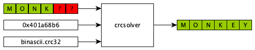
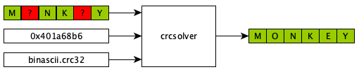
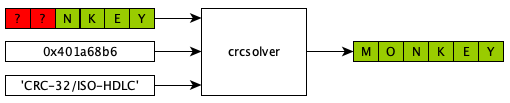

### Example

Supply the known data, unknown bits, target checksum, and crc function:



```
>>> crcsolver.solve(b'MONK__', range(32,48), 0x401a68b6, binascii.crc32)
b'MONKEY'
```

### Example



```
>>> crcsolver.solve(b'M_NK_Y', [8,9,10,11,12,13,14,15,16,32,33,34,35,36,37,38,39], 0x401a68b6, binascii.crc32)
b'MONKEY'
```

### Example

You may supply an arbitrary CRC function or the **name** of a CRC algorithm:



```
>>> crcsolver.solve(b'__NKEY', range(16), 0x401a68b6, 'CRC-32/ISO-HDLC')
b'MONKEY'
```

The full list of available named CRC's is found in `crc_catalog.py`.

### Example

This package also can compute checksums:

```
>>> hex(crcsolver.compute(b'MONKEY', 'CRC-3/GSM'))
'0x5'
>>> hex(crcsolver.compute(b'MONKEY', 'CRC-32/ISO-HDLC'))
'0x401a68b6'
>>> hex(crcsolver.compute(b'MONKEY', 'CRC-32/MPEG-2'))
'0xe643d817'
>>> hex(crcsolver.compute(b'MONKEY', 'CRC-64/ECMA-182'))
'0x2cf08634f65960ae'
>>> hex(crcsolver.compute(b'MONKEY', 'CRC-82/DARC'))
'0x240a7856c67f10a2c0f7f'
```

The full list of available named CRC's is found in `crc_catalog.py`.

### Example

You may supply a dictionary of generalized CRC parameters to compute a CRC:

```
>>> hex(crcsolver.compute(b'MONKEY', {'width':32, 'poly':0x04c11db7, 'init':0xffffffff, 'refin':True, 'refout':True, 'xorout':0xffffffff}))
'0x401a68b6'
```

### Prior Art

* http://reveng.sourceforge.net CRC RevEng: arbitrary-precision CRC calculator and algorithm finder
* https://github.com/resilar/crchack Reversing CRC for fun and profit